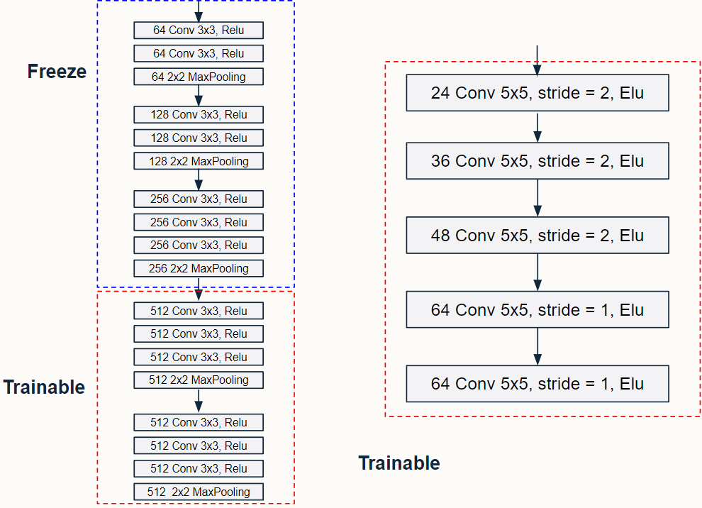
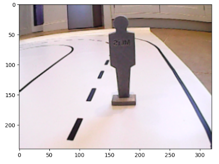

# Self Driving PiCar steering angle and speed prediction
The Machine Learning in Science team organized a [competition](https://www.kaggle.com/competitions/machine-learning-in-science-ii-2024) with a dataset of 13,800 images collected from manual driving sessions with the SunFounder PiCar V on a handcrafted paper road, featuring mock pedestrians and toy traffic signals. Participants were tasked with creating a unified machine learning model to guide the PiCar using input from its camera to determine both steering angle and speed simultaneously. Evaluation included a private test set using Mean Square Error (MSE) as the metric for speed and angle prediction, and a test drive phase on three circuits with simulated obstacles.

Our approach involved concatenating pretrained models, VGG16 (imagenet) and DAVE2 (pretrained from [here](https://github.com/berkcomba/Self-Driving-Car-Keras/)), and adding a fully connected neural network layer for decision-making to enhance contextual understanding. We aimed to improve contextual awareness by simultaneously predicting angle and speed, achieving generalization with VGG16 balancing information from DAVE2. To ensure model effectiveness, we utilized various generalization techniques such as learning rate adjustment, data augmentation, batch normalization, and dropout regularization.

## Network Architecture

  

  <em>Model Overview</em>

  

    
    
<em>VGG16 block</em>

  

  
  

    
    
<em>DAVE2 block</em>

  

  

    
    
<em>FCC block</em>

  

- For both VGG16 and DAVE2:
  - Extract only convolution layers.
  - Apply global average pooling at the end of each layer, resulting in output shapes of 512 and 64, respectively.

- Concatenate the outputs of VGG16 and DAVE2.

- Apply batch normalization and a 20% dropout to the concatenated output.

- Feed the processed output into fully connected blocks:
  - Each block consists of:
    - Dense layer
    - Batch normalization layer
    - ELU activation layer
    - 20% dropout at the end of the block.
  - The first fully connected block uses a dense layer of 256, followed by a block with a dense layer of 64.

- The final layer is a dense layer of 2 representing angle and speed with a linear activation layer, favoring MSE loss.

- Clip the final output to be between 0 and 1.

- Reshape the image to 224 x 224 and 66 x 200 before feeding into VGG16 and DAVE2, respectively.

## Loss Function

- During data inspection, it was observed that some images had a speed equal to 0, indicating the car was stopped due to various reasons such as obstacles, pedestrians, end of the road, or traffic signals.
- In such cases, the current state of steering angle appeared to be incorrect, as the car's trajectory was unaffected when stationary.
- To address this, a modification was made to the loss function to adjust the propagation of information related to steering angle when speed is 0 as following

$$Loss = \frac{\sum\limits_{i=1}^{N}[(s_i - \hat s_i)^2 + (\frac{1+s_i}{2})(a_i - \hat{a_i})^2]}{N}$$

where $s$ and $a$ denoted speed and angle respectively

## Model Training

- First Phase of Training:
  - Freeze all layers from both VGG16 and DAVE2.
  - Train only FCC (Fully Connected Convolution) blocks for 600 epochs.
  - Initial learning rate: 0.001, batch size: 64.
  - Scale down learning rate by a factor of 0.75 every 60 epochs.
  - Trainable parameters: 166,082, which is 2 times lower than the original DAVE2, reducing susceptibility to overfitting.

- Second Phase of Training:
  - Unfreeze the last convolution block of VGG16 and the last three convolution layers of DAVE2.
  - Continue training for 300 epochs to allow convolutions to learn target data information.
  - Set learning rate to $10^{-6}$ for stability during fine-tuning, assuming near-optimal point reached in transfer learning phase.

- Final Phase of Training:
  - Unfreeze the 2nd last convolution block of VGG16 and all convolution layers of DAVE2.
  - Train for 150 epochs.
  - Reduce learning rate by half to $5\times{10^{-7}}$ due to increased trainable parameters.

## Data Augmentation

- To achieve generalization, we employed relevant data augmentation methods to address the limit of the training data and prevent overfitting, especially when unfreezing the majority of layers during fine-tuning, leading to an increase in the number of model parameters.
- Our data augmentation approach includes:
  - Flipping images horizontally.
  - Uniformly randomly rotating images.
  - Randomly cropping images.
  - Randomly adjusting the brightness, contrast, and saturation values of the images.
  - Employing these methods helps the model learn robust features and variations present in the data, leading to improved generalization performance.

### Image Flipping

- As mentioned earlier, we observed a bias in steering angles towards turning right.
- To address this bias, we randomly flipped images horizontally with a probability of 0.5, assuming that each image has an opposite counterpart in turning.
- When flipping an image, the ground truth of the steering angle needs to be adjusted around the value of 0.5 using the following equation:

$$ {angle}' = 1 - angle $$

### Image Rotating
- This augmentation aims to enhance the model's robustness in scenarios where the camera recording may not be perfectly aligned horizontally.
- We limit the absolute value of rotation to just 5 degrees to prevent excessive distortion.
- This approach is based on suggestions from a referenced paper.

  
  

    
    
<em>Original</em>

  

  

    
    
<em>Rotated</em>

  

### Color Jitter

- Color Jitter augmentation is aimed at enhancing the model's robustness in scenarios with varying lighting conditions.
- The intuition is to prepare the model for situations where the light in the testing environment is unstable or changes abruptly.
- It also helps the model adapt to scenarios where the camera records images with abnormal color due to damage or malfunction.

  
  

    
    
<em>Original</em>

  

  

    
    
<em>Alternated Color</em>

  

### Randomly Cropping Image
- In this augmentation method, we randomly crop out a small percentage of the images.
- The intuition behind this approach is to introduce additional variation to the dataset, helping the model generalize better.

  
  

    
    
<em>Original</em>

  

  

    
    
<em>Randomly Cropped</em>

  

### Randomly Add Artificial Shadow
- We randomly add artificial shadows to emphasize the model's understanding of obstacle shapes.
- This augmentation simulates scenarios where shadows of objects like tables, humans, or chairs may appear during a real test drive.
- By exposing the model to such variations, we aim to improve its ability to distinguish between actual obstacles and shadows.

  
  

    
    
<em>Original</em>

  

  

    
    
<em>Randomly Added Shadow</em>

  

### All augmentation together

  
  

    
    
<em>Original</em>

  

  

    
    
<em>All Augmented</em>

  

## Data Generator & Splitting

### Data Generation
- For each epoch, the training data is shuffled to ensure that every batch has no specific pattern.
- Each augmentation technique is independently applied to each image with the following probabilities:
  - Image flipping: 0.5
  - Other augmentation techniques: 0.33
- Loaded images for each batch are normalized by dividing the pixel values by 255 to keep the range between 0 and 1 and avoid gradient explosion.
- Images are duplicated, with one copy reshaped to 224 x 224 and the other reshaped to 66 x 200, then passed to the input layers of VGG16 and DAVE2 respectively.

### Data Splitting
- The available data, totaling 13.8k images, is split into three sets:
  - Training set
  - Validation set
  - Test set
- The model is trained on the training set, and the model is saved when the validation loss hits a new low.
- The saved model is then evaluated on the test set to avoid bias in model evaluation.

## Train model on all data without overfitting

- To ensure our model learns from the entire training dataset and achieves a high score on the competition leaderboard without overfitting, we need to train the model on the entire data while also ensuring generalization.
- One challenge is the lack of holdout test data when using the entire dataset for training, making it difficult to assess model generalization.
- To address this issue, we employ k-fold cross-validation, splitting the data into k folds, with 5 folds used in our case.
  - During each iteration, we train the model on four of the folds and evaluate its performance on the remaining fold.
  - This process is repeated until each fold has been used as the test set once, resulting in 5 models trained on different subsets of data.
  - We then use the mean prediction value from these 5 models on the test data and submit it to the competition for evaluation.

## Experiments and results
## Model Development and Results

- **Baseline Model Development:**
  - Trained two separate models for angle and speed prediction using the DAVE2 architecture from scratch.
  - Trained for 50 epochs with MSE loss for angle prediction and binary cross-entropy loss for speed prediction.
  - Input shape: 128x128 pixels.
  - Achieved MSE scores of 0.02929 (public) and 0.03369 (private).
  
- **Combined Model Development:**
  - Combined angle and speed predictions into a single model using the same DAVE2 architecture with linear activation for both angle and speed.
  - Improved scores to 0.02877 (public) and 0.03328 (private).

- **Data Augmentation:**
  - Explored data augmentation techniques including shift, scale, and rotation with a 0.5 probability.
  - Resulted in further improvement with scores of 0.02654 (public) and 0.02814 (private).

- **Pre-trained DAVE2 Model:**
  - Utilized pre-trained DAVE2 model weights trained on self-driving car data for 300 epochs.
  - Learning rate reduced with a factor of 0.75 every 50 epochs.
  - Achieved scores of 0.02145 (public) and 0.02454 (private).

- **Model Restructuring:**
  - Restructured DAVE2 architecture by replacing the flatten layer with global average pooling.
  - Resized fully connected layers to align with the output size of convolutional layers.
  - Incorporated batch normalization, dropout, and ELU activation function.
  - Improved scores to 0.01581 (public) and 0.01655 (private).

- **Concatenated Model Approach:**
  - Concatenated VGG16 and DAVE2 architectures with pre-trained weights.
  - Achieved scores of 0.01143 (public) and 0.01345 (private).
  - Applied custom MSE loss function, resulting in improved scores of 0.01119 (public) and 0.01344 (private).

- **K-Fold Ensemble Prediction:**
  - Implemented k-fold cross-validation to ensure the model learns from all data without overfitting.
  - Improved scores to 0.01068 (public) and (private).

- **Post-processing and Correction:**
  - Corrected 3000 more data points and wrong labels in the training set.
  - Utilized an object detection model for post-processing.
  - Achieved scores of 0.0914 (public) and 0.01328 (private).
